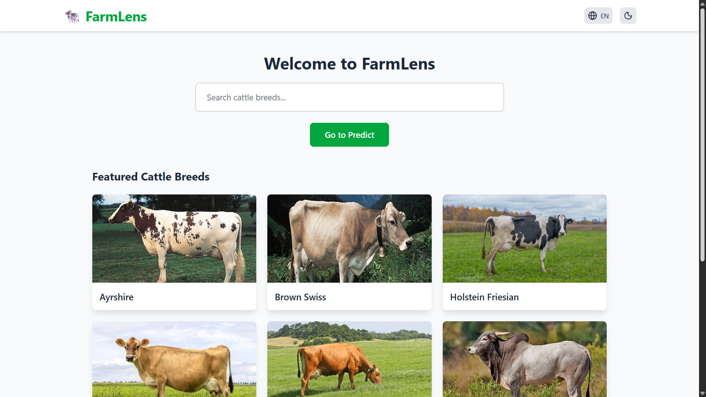
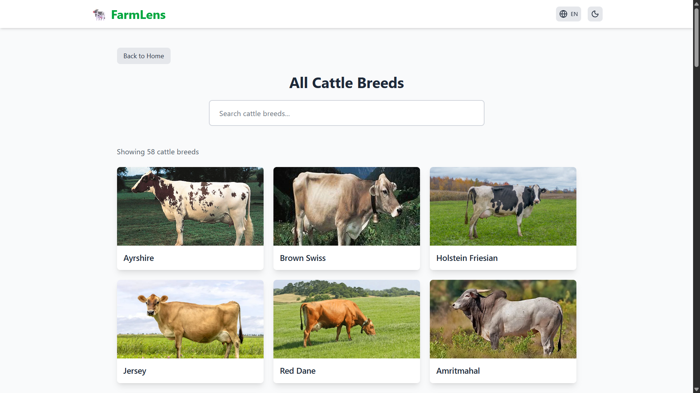
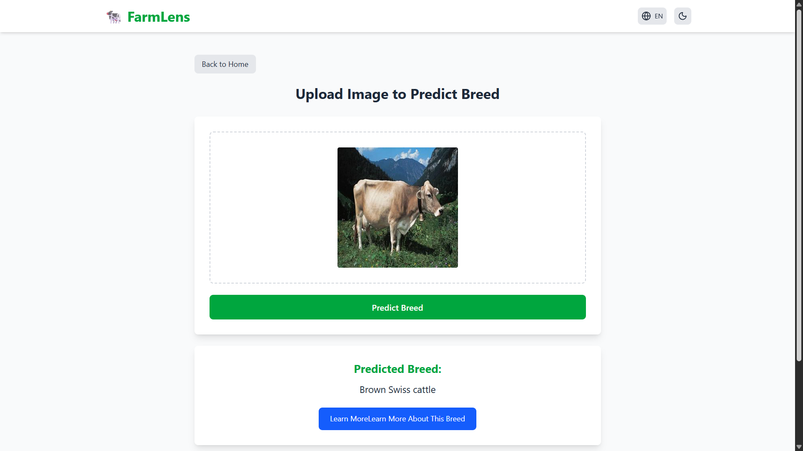
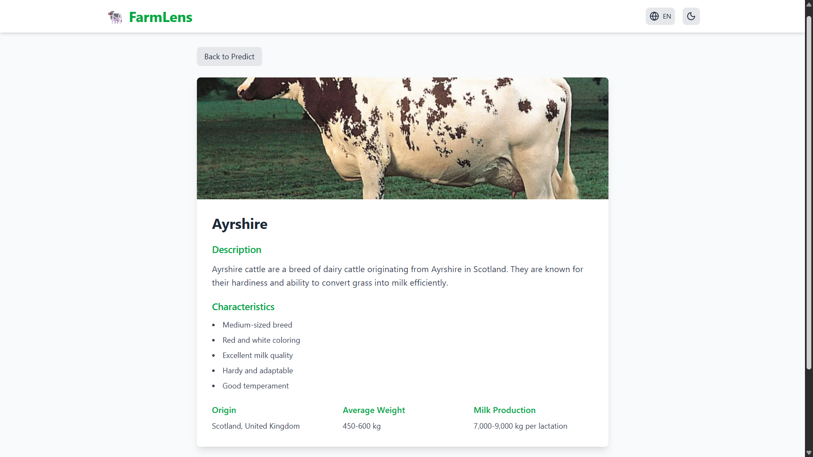
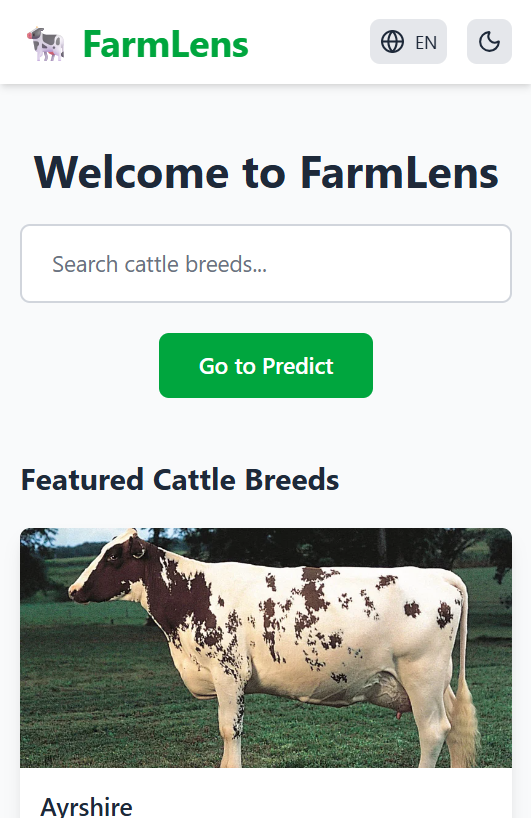
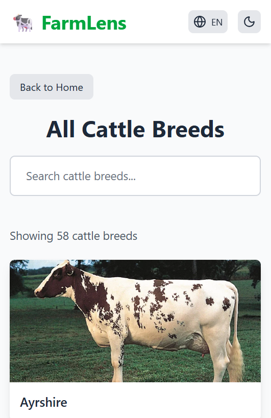
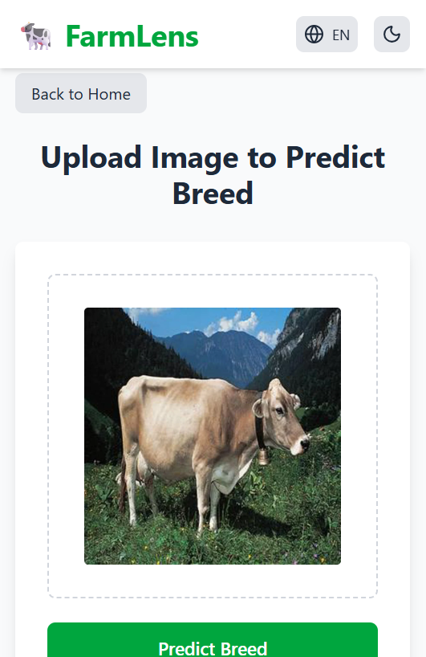
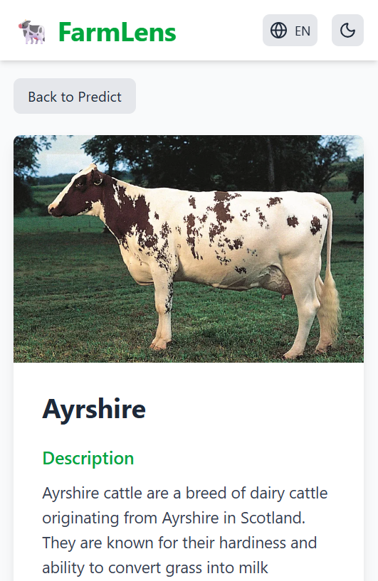

<div id="top"></div>

<div align="center">

# 🐄 FARMLENS
*A Cattle Breed Recognition App Using Machine Learning & Image Uploads*


**Tech Stack Used**


</div>

---

## 📸 Screenshots

### 🖥️ Desktop View

| Home | Breed Info | Predict | Breed Info Card |
|:--:|:--:|:--:|:--:|
|  |  |  |  |

### 📱 Mobile View

| Home | Breed Info | Predict | Breed Info Card |
|:--:|:--:|:--:|:--:|
|  |  |  |  |

---

## 📑 Table of Contents

- [Overview](#-overview)
- [Demo](#-demo)
- [Features](#-features)
- [Tech Stack](#-tech-stack)
- [Project Structure](#-project-structure)
- [Getting Started](#-getting-started)
- [Usage](#-usage)
- [Future Enhancements](#-future-enhancements)
- [Contact](#-contact)

---

## 🧐 Overview

**FarmLens** is a cattle breed recognition app powered by a **PyTorch model trained on 1000+ images**. Users can explore detailed information on **57 cattle breeds** and predict the breed of any cattle from an uploaded image.  
It uses a **Vite + React frontend** and a **FastAPI backend (`app.py`)** to serve predictions and breed data.

---

## 🔗 Demo

> Live Preview: https://farmlens.vercel.app

---

## ✨ Features

✅ Recognize cattle breed from uploaded image using ML model  
✅ Information on 58 different cattle breeds  
✅ PyTorch model trained on 1000+ images  
✅ FastAPI backend for serving predictions  
✅ Vite + React frontend for smooth UI  
✅ Fully responsive design – Desktop & Mobile 
✅ Theme switch (Light/Dark mode)  
✅ Language switch (Hindi / English)    


---

## ⚙️ Tech Stack

### **Frontend:**
- React (Vite)
- Tailwind CSS
- Axios
- Context API
- Theme & Language Switch implemented using React Context API

### **Backend:**
- Python (FastAPI)
- PyTorch (ML Model)
- Pillow (Image Processing)

### **Deployment:**
- Vercel / Any Python-friendly hosting for backend

---

## 📂 Project Structure

```bash
FarmLens/
├── frontend/                     # Frontend (React + Vite)
│   ├── public/
│   └── src/
│       ├── assets/images/
│       ├── components/
│       ├── data/
│       ├── pages/
│       └── App.jsx
└── backend/                     # Backend (FastAPI + PyTorch)
    ├── app.py                   
    ├── requirements.txt
    └── runtime.txt

```

---

## 🚀 Getting Started

### ✅ Prerequisites

- Node.js & npm installed
- Python 3.10+ installed
- PyTorch installed
- FastAPI & Uvicorn

---

### 👇 Installation

```bash
# Clone the repository
git clone https://github.com/Surya821/FarmLens

# Navigate to the project
cd FarmLens
```

### 🔧 Setup Client

``` bash
cd frontend
npm install
npm run dev
```

### 🖥️ Setup Server

``` bash
cd backend
npm install -r requirements.txt
uvicorn app:py --reload
```

---

---

## ▶️ Usage

1. **Open the app in browser**
2. **Browse cattle breeds and information**
3. **Upload image to predict cattle breed**
4. **View prediction and details**

---

## 🚧 Future Enhancements

- 🟦 Multi-image batch predictions  
- 🟦 Breed similarity suggestions
- 🟦 User accounts to save favorite breeds
- 🟦 Mobile-friendly app wrapper (PWA / App)
- 🟦 Voice recognition for breed info

---

## 📬 Contact

**Created by — Surya Pratap Singh**  
📩 **Contact Me:**  
[LinkedIn](https://www.linkedin.com/in/surya-pratap-singh1/) • [Gmail](mailto:surya30082005@gmail.com)

If you like this project, consider giving it a ⭐ on GitHub!

<p align="right">(<a href="#top">⬆️ Back to Top</a>)</p>


